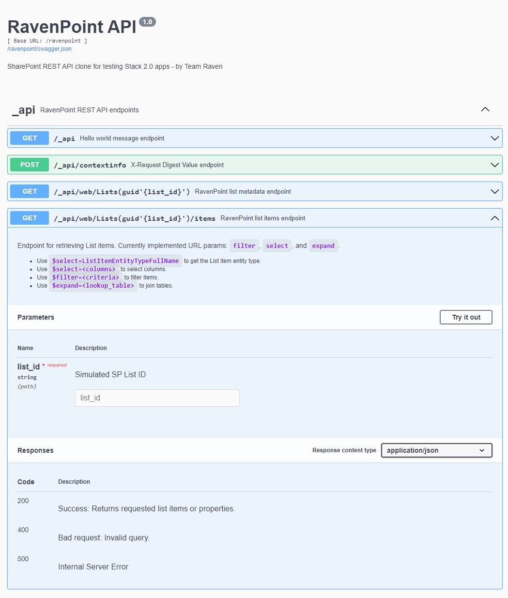
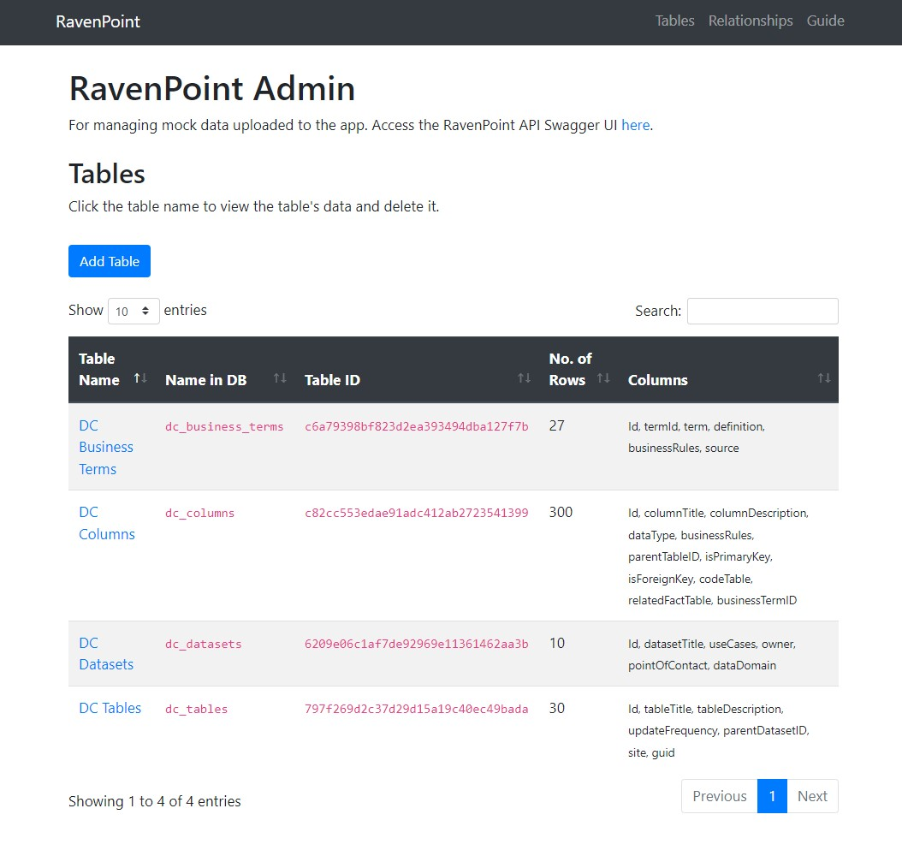

# RavenPoint
A SharePoint REST API clone built in Python (Flask) for testing apps that use SharePoint Lists as a backend for storing data.

<p>
    <a href="https://www.python.org/">
        
    </a>
    <a href="https://flask.palletsprojects.com/en/2.0.x/">
        
    </a>
</p>

## Motivation
There is a huge disparity between the development and production environments for Team Raven's React.js apps due to ******* ******** IT policy. This creates challenges in development.

First, the development of the frontend and some of the backend features happens in the development environment, and development of code to interact with databases happens in sandboxes in the production environment. This surely isn't a best practice for React apps. It isn't possible to test code to query data from SharePoint (SP) Lists via the SP OData REST API.

Second, this affects the build process. Apps cannot be bundled into a production build, since development still happens after code is ported over into the production environment. That makes it extremely challenging to use awesome open-source React components that cannot be easily bundled into individual JS files.

## Value Proposition
RavenPoint aims to enable Team Raven to do all development in a single environment (i.e. not on internal servers). Instead of trying to bring modern development tools in, which will probably never happen in the next few generations, we aim to emulate the internal stack on the outside.

If all development and testing can happen on the outside, we can (1) make full use of open-source tech in our apps because we can (2) create production builds without worrying about having to amend the code later on. 

In the longer term, when (or if) an internal cloud is made available, RavenPoint can potentially be the bridge between (a) apps that still use dated OData queries and (b) modern databases in the backend - this is exactly how RavenPoint is set up.

## Features

### REST API
- Mimics SharePoint's (SP) REST API
- URL parameters:
  - `$select`: For selecting columns from tables
  - `$filter`: For filtering rows by criteria
  - `$expand`: For selecting columns in linked lookup tables



### Admin Dashboard
- Upload a CSV file + table name to be stored in a SQLite database
- Check table metadata (ID, title, columns)
- Inspect tables
- Delete tables



## Installation
First, clone this repository to a local directory.

```bash
# Clone repo
git clone https://github.com/chrischow/ravenpoint.git
```

Second, use the `conda-requirements.txt` file to install the dependencies in a new virtual environment.

```bash
cd ravenpoint
conda create --name ravenpoint --file conda-requirements.txt
```

Then, activate the environment and initialise the database.

```bash
conda activate ravenpoint

flask db init
flask db migrate -m "Initial migration"
flask db upgrade
```

### Optional Step: Fake Data
You may opt to add fake data to the database. You will need to write your own code, but two examples have been provided:

- `fake_data.py`: Demo data for the [RDO Data Catalogue](https://github.com/chrischow/rdo-data-catalogue).
- `rokr_data_demo.py`: Demo data for [ROKR](https://github.com/chrischow/rokr).

Be sure to add the supporting relationships via the admin panel.

| Fake Data | Table Name | Table Column | Lookup Table | Lookup Table Column |
| :-------- | :--------- | :----------- | :----------- | :------------------ |
| `fake_data.py` | dc_tables | parentDataset | dc_datasets | Id |
| `fake_data.py` | dc_columns | businessTerm | dc_business_terms | Id |
| `fake_data.py` | dc_columns | parentTable | dc_tables | Id |
| `rokr_data_demo.py` | rokr_key_results | parentObjective | rokr_objectives | Id |

## Usage
In the `ravenpoint` folder, activate the environment and start the Flask development server:

```bash
cd ravenpoint
conda activate ravenpoint
python app.py
```

The RavenPoint admin panel should be running on `http://127.0.0.1:5000/`.

## Resources
- OData query operators: [Microsoft documentation](https://docs.microsoft.com/en-us/sharepoint/dev/sp-add-ins/use-odata-query-operations-in-sharepoint-rest-requests)
- Parser for OData filters: [odata-query](https://github.com/gorilla-co/odata-query)
- NotEqualTo Validator: [wtforms-validators](https://github.com/akhilharihar/wtforms-validators)

## Notes

### Logic for OData Filter Parser
Test queries:

- Starts with:

  ```
  http://127.0.0.1:5000/ravenpoint/_api/web/Lists(guid'797f269d2c37d29d15a19c40ec49bada')/items?$select=Id,tableTitle,parentDatasetID/datasetTitle,parentDatasetID/dataDomain,parentDatasetID/owner&$expand=parentDatasetID&$filter=startswith(parentDatasetID/dataDomain,'O') and startswith(parentDatasetID/owner,'B')
  ```

- Substring of:

  ```
  http://127.0.0.1:5000/ravenpoint/_api/web/Lists(guid'797f269d2c37d29d15a19c40ec49bada')/items?$select=Id,tableTitle,parentDatasetID/datasetTitle,parentDatasetID/dataDomain,parentDatasetID/owner&$expand=parentDatasetID&$filter=substringof('O', parentDatasetID/dataDomain) and substringof('2', parentDatasetID/owner)
  ```

- Multiple expansion:

  ```
  http://127.0.0.1:5000/ravenpoint/_api/web/Lists(guid'c82cc553edae91adc412ab2723541399')/items?$select=Id,columnTitle,parentTableID/tableTitle,parentTableID/updateFrequency,businessTermID/term,businessTermID/source&$expand=parentTableID,businessTermID&$filter=parentTableID/updateFrequency eq 'daily'
  ```

#### Proposed Approach: Convert to SQL
The idea is to make minimal changes to the OData query to convert it to SQL. Currently, this involves:

1. Converting `lookupColumn/` to `rightTableDbName/`
2. Replacing operators:
  - E.g. ` le ` to ` < `
  - E.g. ` ne ` to ` != `
3. Replacing functions: `startswith` and `substringof`
  1. Extract parameters between the brackets
  2. Re-write them as `Column LIKE string%` and `Column LIKE %string%` respectively

For the date functions `day`, `month`, `year`, `hour`, `minute`, `second`, more work needs to be done. Fortunately, SQLite has some [datetime functions](https://www.sqlite.org/lang_datefunc.html) to work with. Preliminary concept:

1. Convert all `datetime'YYYY-MM-DD-...'` strings to `date('YYYY-MM-DD-...')`
2. Convert all `day/month/year/hour/minute/second([Colname | datetime'YYYY-MM-DD...'])` strings to `strftime([Colname | datetime'YYYY-MM-DD...'], '[%d | %m | %Y | %H | %M | %S]')`

### Logic for Multi-value Lookups
Setup:

1. Users must indicate whether a field is multi-lookup or single-lookup e.g. `businessTerm` (user can select multiple) as the lookup column
2. If multi-lookup, create a dataframe with:
  - Left table's indices in a column with the left table's DB name (e.g. `dc_columns_pk`)
  - Multi-lookup table's values in a column with the lookup table's DB name (e.g. `dc_business_terms_pk`) - this should have a list in every cell
  - Explode the column `dc_business_terms_pk` into its constituent keys so this column now has one multi-lookup table key per row
3. Save this as a new table, perhaps `dc_columns_dc_business_terms`


When some query involving the multi-lookup table is concerned:

1. **Select:** It's ok to use the selected columns, since we're still taking data from the lookup table
2. **Expand:** DO NOT use the lookup column `businessTerm` to expand. Instead:
  - `dc_columns` LEFT JOIN `dc_columns_dc_business_terms` because we want all columns
  - ... LEFT JOIN `dc_business_terms` with the required columns, since we only want terms that were listed in the columns
3. **Filter:** Use whatever filters there were - it's fine
4. **Post-processing in pandas:**
  - Process multi-lookup columns into a single column with dictionaries first
  - Group rows by all columns other than the requested columns from `dc_business_terms` (i.e. Id and Title at most)
  - Aggregate (`agg`) with `lambda x: x.tolist()`, naming that column with the lookup column's name `businessTerm`
    - Those with no matching terms should have an empty list
  - Process single-lookup columns into a single column with dictionaries
